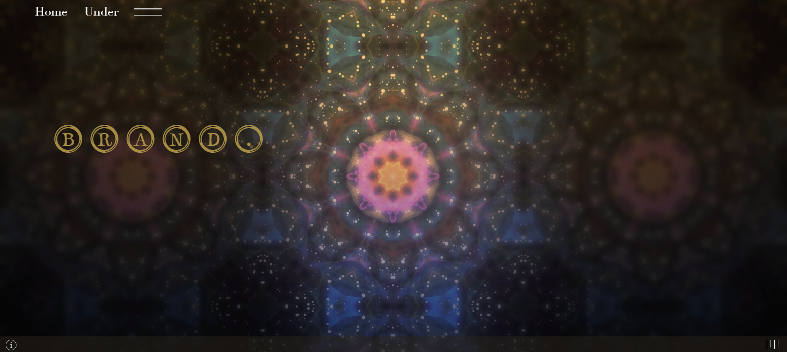
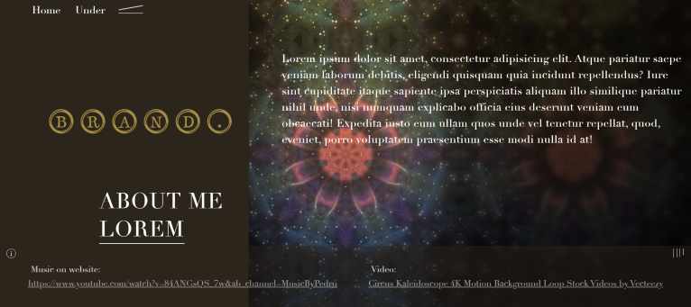

# Vintage Site

Project on which I learned animation and DOM manipulation

## Tech

- JavaScript
- Css
- Html 5

[https://maciek7987.github.io/Vintage-Site/]

## Some information about project

My first project where, i add video and audio. The most hardest was create wave animation turn on and off music. I had to replace animation in the moment when music is play and is off. 

## Sources

animation wave and hamburger was inspirated from https://rupert-rothschildvignerons.com/